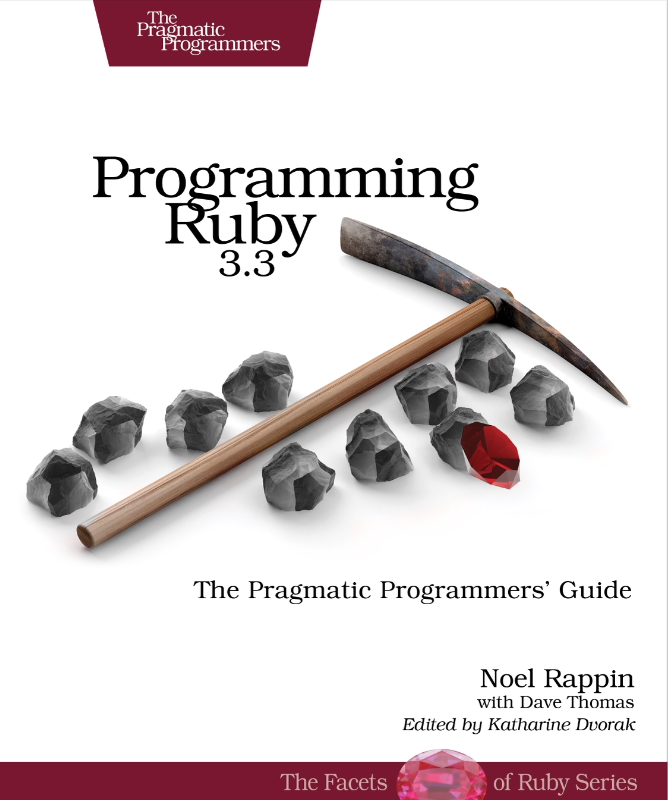

# It's Time to Learn Ruby

Around the mid-2000s, I heard about Ruby on Rails. Even for someone like me whose primary focus is game development, I heard how it was making waves in the web development world. Eventually, the curiosity got the best of me; I had to see what it was all about!

Unfortunately, I was not at a company where I could use Rails professionally. Outside of work hours, I went through a few tutorials to learn the basics of Ruby and Rails by building a simple blog with some posts and a comments section. Even with my limited web development experience at the time, I understood the reason for such excitement within the community. Rails seemed like pure magic; beautifully crafted with an incredible focus on developer productivity thanks to the elegance of Ruby, and common sense defaults focusing on convention over configuration.	

Fast forward to today, I'm now learning Ruby and Rails again for a few new project ideas. To get started with Ruby, I'm reading the 5th edition of what the Ruby community refers to as the pickaxe book: [Programming Ruby](https://pragprog.com/titles/ruby5/programming-ruby-3-3-5th-edition/) by Noel Rappin and Dave Thomas. I'm currently on chapter 3, reading about classes, objects, and variables.



Here are a few things I've learned so far about Ruby that I think are interesting.

# Truly Object-Oriented

First and foremost, Ruby is an object-oriented language. That's to say, practically everything in Ruby is an object. For example, when you use a number like 5, that creates an instance of the Integer class. Instead of importing a separate set of methods to work with primitives, in Ruby you call methods directly on the objects, like ".positive?". Notice the "?" at the end. With Ruby you can literally read the variable name as a question. I think it's quite beautiful and now I don't want to use a language without it.

There's a lot of noise in most programming languages, and the lot of it simply doesn't exist in Ruby. Parentheses can be omitted from if statements and loops, and they're optional when calling methods, even when passing arguments.

# Regular Expressions. Built in.

Ruby has built-in support for regular expressions; it's quite elegant, and of course, a regular expression is an object! You can use the match operator (~=) to match a string against an expression, and because the starting position of the match is returned (nil otherwise), you can easily use them in condition statements.

# Blocks For Everyone

The final thing I want to mention is blocks. I'm sure you're familiar with the general concept of code blocks in other languages, but in Ruby they are quite special because all methods can be optionally be passed a block to execute once or multiple times! Within the methods, the yield keyword will call the provided block. Blocks can also accept arguments which can also be passed when calling yield.

As an example, when calling the ".each" method on an array, you can pass a block that will be executed once for each element like so (taken from the book):

```ruby
animals = ["ant", "bee", "cat", "dog"]
animals.each { |animal| puts animal }
```

I'm just scratching the surface of Ruby and enjoying my time with it. I'll continue to write as I read through the book and use Ruby for new projects. After years of working in strongly typed C-based languages, it's a breath of fresh air to learn Ruby, and I recommend you give it a try as well.