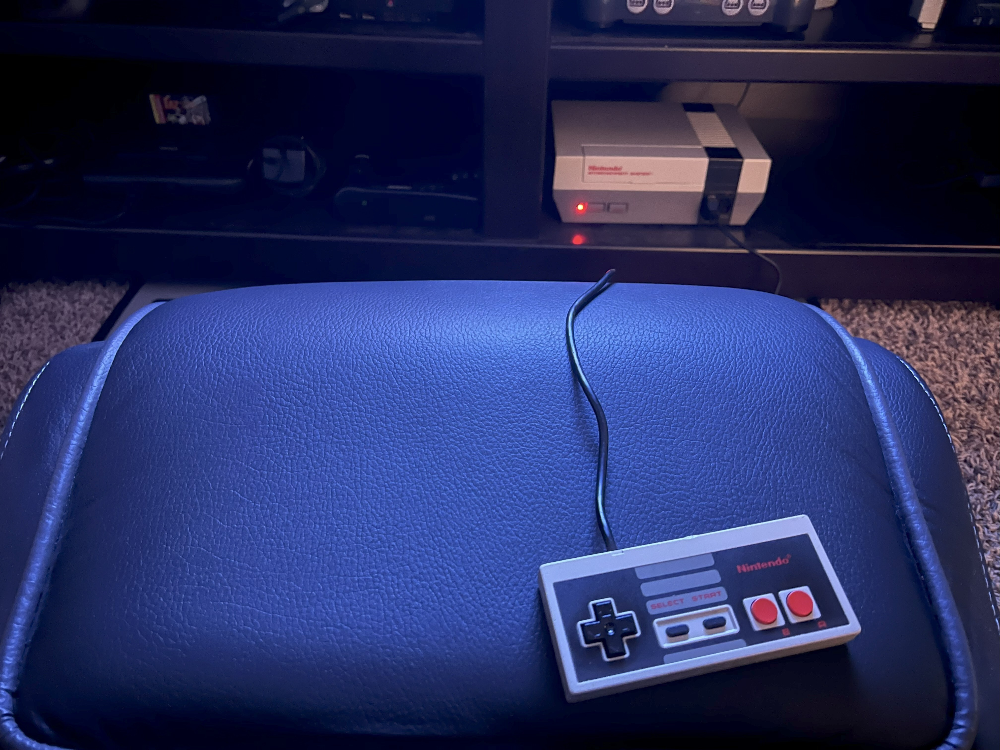

When I was younger, I took everything I studied and practiced seriously. Every hobby became a grind or side hustle.

Guitar led to wanting to be in a band as a lead guitarist and tour. Programming led to wanting to work on a product that had a huge positive impact on the world. Even Yo-Yo led to wanting to enter competitions.

On and on, it was this way with everything I did.

What I didn't realize is just how much of the joy I took away from what should have just been fun.

Now, I play/write music and games just for the enjoyment and when I'm inspired to do so. There's no rush or intent to go full-time.

In fact, I don't rush anything anymore. I love the journey of learning. Right now, I'm practicing piano more often, and thinking about taking drum lessons. I've also been continuing to learn to speak and write Japanese.

As many look toward an all digital future, I'm rediscovering my love for music and my favorite artists through buying vinyl LPs and a record player for the first time in my life.

I have a physical game library from my childhood, from NES to the Dreamcast, ensuring I don't have to worry about licensing games; I own what I want to play.

This is what it feels like to enjoy a simple life. 
I've come full circle, and I couldn't be happier.
