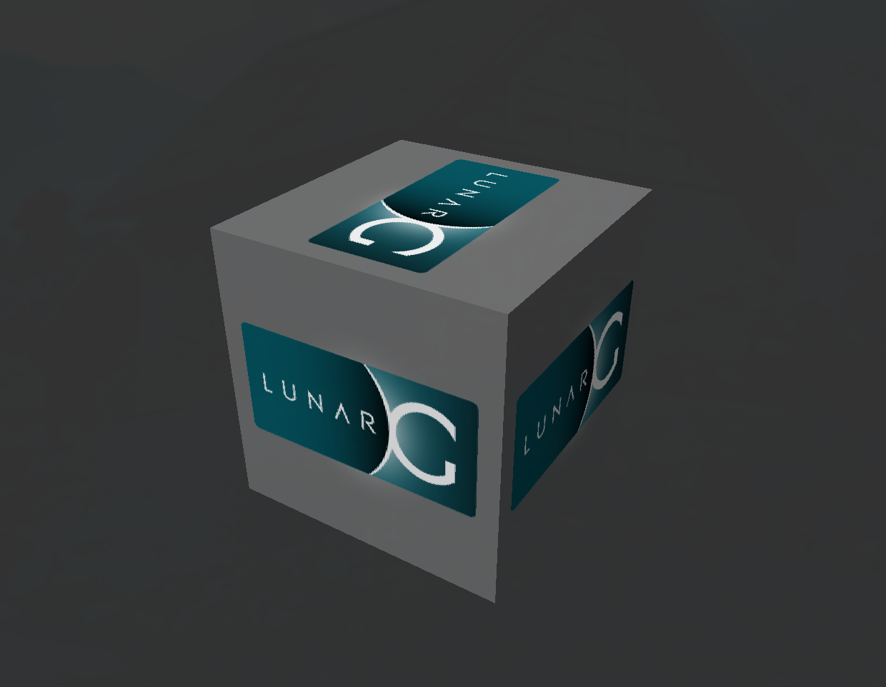

# Downloading AMD Radeon Drivers on Omarchy

As you have probably seen me post about (a few times), I've been testing the Omarchy distro recently to see if it's something I could transition to for both personal use and game development at Emberwell Games. Right now I'm using an HP Dev One that had been abandoned, left in a closet to collect dust. No more! It's now a primary working machine during this test run.

All the software I use was working well, but I realized as soon as I launched Godot that the forward+ renderer option was not available for my video card (AMD Radeon Vega 8). That lead me down the path of figuring out how to download drivers for it on Arch. Hopefully someone out there will find this helpful.

Before you get started, you might want to see how the card is being detected first.

```bash
lspci -k | grep -A 2 -E "(VGA|3D)"
03:00.0 VGA compatible controller: Advanced Micro Devices, Inc. [AMD/ATI] Cezanne [Radeon Vega Series / Radeon Vega Mobile Series] (rev d1)
	DeviceName: Onboard IGD
	Subsystem: Advanced Micro Devices, Inc. [AMD/ATI] Device 0123
```

Next, we'll install few packages for the drivers, loader, and vulkan tools we'll use to verify the install.

```bash
sudo pacman -Sy vulkan-radeon vulkan-lcd-loader vulkan-validation-layers vulkan-tools
```

With those installed, we can verify using `vulkaninfo`

```bash
vulkaninfo | less
```

If you see a long list of details about the instance, you're all set!

There is a more fun way to verify the install though - `vkcube` will launch a rotating cube.


